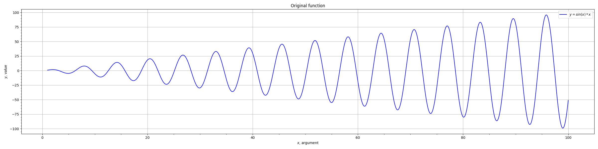
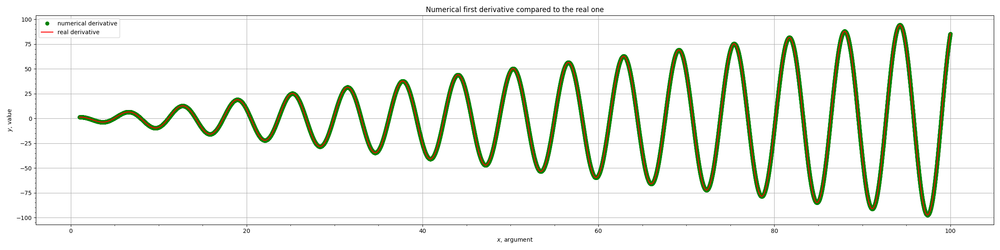
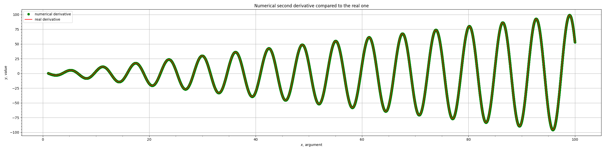
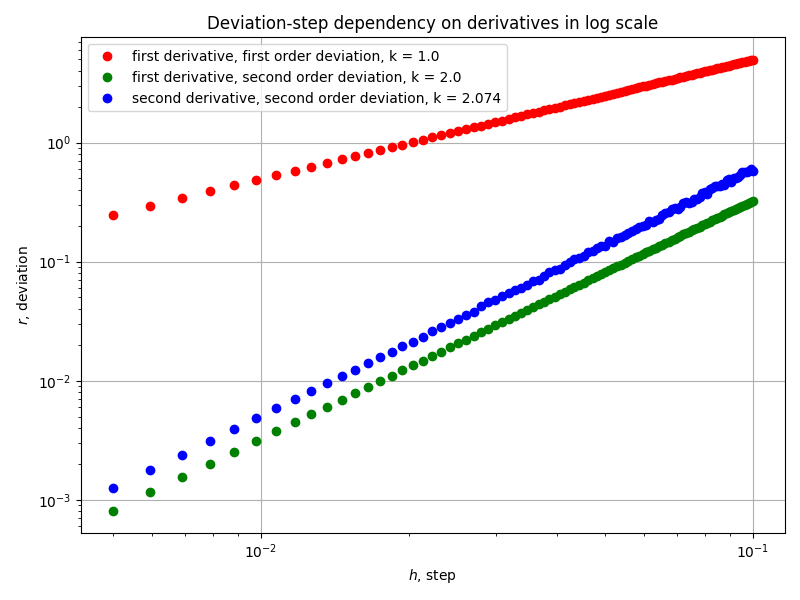

# Numerical derivative
Calculate the first derivative of the given function with first and second order of deviation, and the second derivative with the second order of deviation.

**Given function:** sin(x) * x

**First derivative:**

**Second derivative:**

**Deviation-step dependency:**

